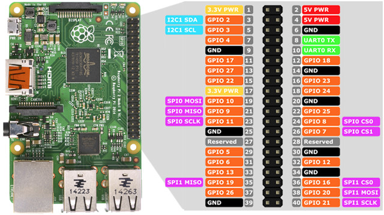

# pythonScript

## Instalación

Actualizacion de bibliotecas disponibles.
```bash
sudo apt-get update
```
Instalacion de python si todavia no lo tiene instalado 

```bash
sudo apt install python3
sudo apt install python3-pip
```


Instalación de la libreria para leer los gpios
```bash
sudo apt-get install python3-rpi.gpio
```

A continuación todos los comandos para ejecutarlos a la vez.

```bash
sudo apt-get update
sudo apt install python3
sudo apt install python3-pip
sudo apt-get install python3-rpi.gpio
```

## Ejecutar script

Dirigirse a la ruta donde esta el script y escribir:

```bash
python3 pyScript.py
```

Esto dejará lanzado el script.

## Configuración para lanzar script al inicio

Para configurar el script al iniciar la raspberry es necesario abir fichero bashhrc.

```bash
sudo nano ~/.bashrc
```
Al final del fichero incluir lo siguiente (asumiendo que el script esta en una ruta del escritorio)

```bash
cd /home/pi/Desktop/pythonRaspberry
while true; do
    python3 pyScript.py >> ~/python_script.log 2>&1
    if [ $? -ne 0 ]; then
        echo "El script falló. Reiniciando..." >> ~/python_script.log
        sleep 5
    else
        break
    fi
done
```

Cerrar el fichero guardando los cambios y reiniciar:

```bash
sudo reboot
```

Para consultar los logs que va generando el script escribir en el terminal:

```bash
tail -f ~/python_script.log
```


## Pines GPIO

Pines Gpio de la raspberry



## Configuracion del script

Estos son los campos que son necesario modificar antes de ejecutar el script.

### Configuracion de gpios

gpio_pins es la variable que incluye los gpios que va a leer.
Por ejemplo GPIO 26 se corresponde a 26 en la lista

```bash
# Configuración de los GPIOs
GPIO.setmode(GPIO.BCM)  # Numeración BCM
gpio_pins = [26, 5, 6, 13]  # Reemplazar con los pines conectados

# Configurar los pines GPIO
for pin in gpio_pins:
    GPIO.setup(pin, GPIO.IN)  # Configura el pin como entrada
```
### Configuracion datos servidor

La variable HOST contiene la ip del servidor y PORT el puerto.

```bash
# Configuración del socket
HOST = '192.168.0.17'  # Dirección IP del servidor
PORT = 4040            # Puerto del servidor
```
### Intentos de comunicacion

max_retries es la variable que indica el número de intentos de comunicación con el servidor antes de darla como erronea

```bash
# Configuración de reintentos
max_retries = 3  # Número máximo de reintentos
```
### Intentos de comunicacion

device_id id del device que envia los datos

```bash
# Identificador del dispositivo (4 bytes)
device_id = 12345  # Cambia este valor según tu necesidad

```
